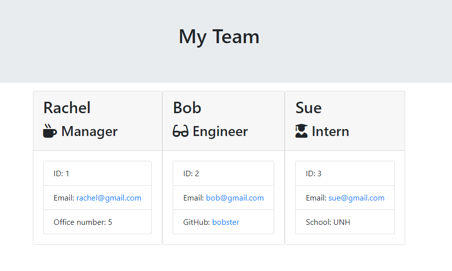

# TemplateEngine

## Description

This is a node command line application that genererates an engineering team, consisting of a manager and any number of Engineers and Interns, from user input. First, the user is prompted for information about the manager and then the members of the team, and then an HTML file will be created to display an engineering team roster based on the user's input.

## Screenshots

## Built with

JavaScript
HTML
Node
Inquirer

## Installation

npm i inquirer

## I learned:

1. How to import and export files
2. How to work with classes and constructors
3. To gather user input using inquirer package
4. How to run tests using Node

## Challenges:

1. I found it difficult basing inquirer prompts on the answers from other inquirer prompts.
2. I had trouble getting the questions to cease upon user imput that user was done adding employees.
3. I wasn't sure how to set the code so that it would accept a Manager only once.

## Walkthrough

[Walkthrough](https://drive.google.com/file/d/1IEas37dbttkwXx4PKBOYWPbXMqX7nlZ5/view)

## Feedback:

[GitHub](https://github.com/smanter82)

Email: sarahmanter@gmail.com

Some code on this application may have been done in collaboration with my Bootcamp study group classmates: https://github.com/arensalmela, https://github.com/dmaysteinman, https://github.com/EddiePhi, https://github.com/ReindeerCode, https://github.com/DustinErwin, https://github.com/Ewager1, https://github.com/mdjonestwo, https://github.com/shannonquinn91/Note-Taker, https://github.com/JesalDM
